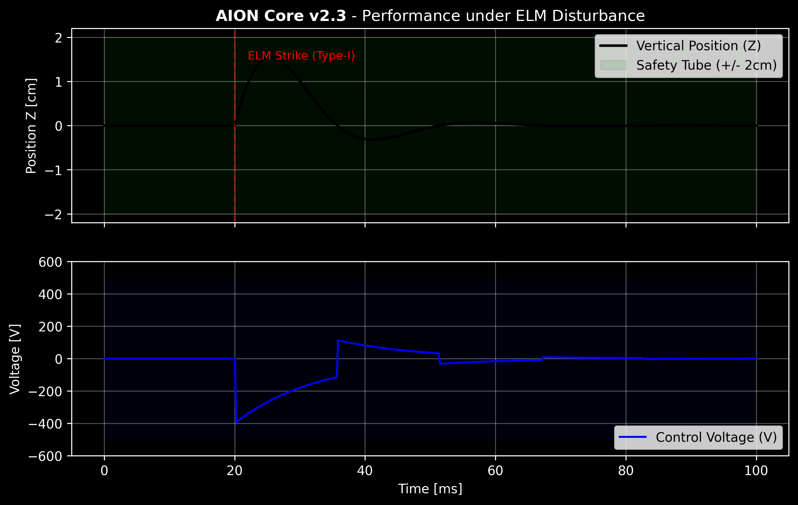

# AION Core v2.3

Adaptive Robust Control Framework for Tokamak Vertical Stabilization.

## Features
- Square-Root RLS Identification
- Tube-based MPC
- NOBEL Safety Interlock
- ### 📊 Performance Benchmark
AION v2.3 demonstrating stable recovery under Type-I ELM disturbance:

