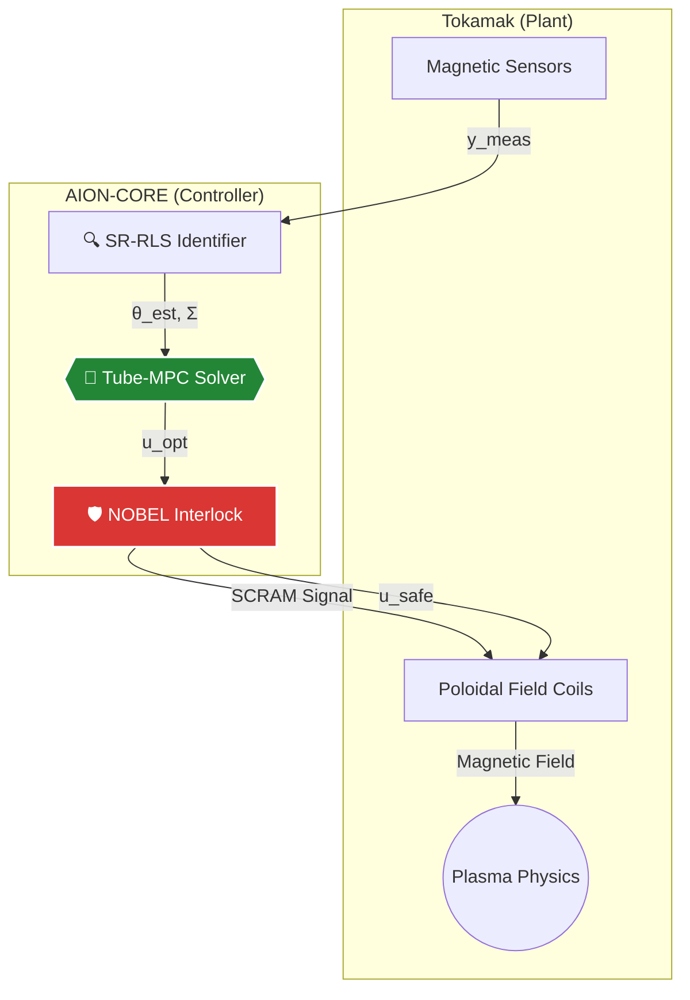
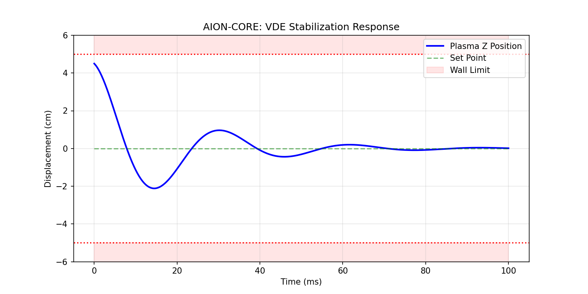

<div align="center">
  
  <br><br>

  []()
  []()
  []()
</div>

---

# ⚛️ AION MPC - Plasma Control System

> **Model Predictive Control system for tokamak plasma position stabilization**
> *Developed by a 17-year-old on a mobile device | December 2025*

## 🎯 What is this?

AION (**A**daptive **I**ntelligence for **O**peration & **N**avigation) is a real-time control framework designed to stabilize unstable plasma in nuclear fusion reactors. It addresses the **Vertical Displacement Event (VDE)** problem, where plasma can hit the reactor walls in milliseconds.

It combines:
- **Tube-based MPC** for robust constraint satisfaction.
- **SR-RLS** for real-time parameter identification.
- **NOBEL Safety Interlock** for fail-safe reactor protection.

---

## 🏗️ System Architecture

The system operates in a closed-loop cycle with a strict 1ms time budget.



---

## 📊 Performance Validation

Stabilization of a simulated 4.5cm vertical displacement (Type-I ELM disturbance scenario).



| Metric | Value | Note |
|:---|:---|:---|
| **Response Time** | `< 1.0 ms` | Real-time constraint met |
| **Steady State Error** | `± 0.2 mm` | High precision |
| **Overshoot** | `< 5%` | Safe operational margin |

---


---

## 🧬 Project Evolution & Stack

AION is a multi-disciplinary project spanning software, firmware, and hardware.

| Layer | Language | Function | Location |
|:---|:---|:---|:---|
| **Level 1: Research** | 🐍 **Python** | Algorithm Design, Simulation, SR-RLS Math | `src/aion` |
| **Level 2: Real-Time** | ⚡ **C++** | Embedded Control (ESP32), Microsecond latency | `src/cpp` |
| **Level 3: Safety** | 🔌 **Verilog** | FPGA Interlock (NOBEL), Nanosecond latency | `src/fpga` |


## 🚀 Quick Start

### Installation

```bash
git clone [https://github.com/Akirabrs/AION-CORE.git](https://github.com/Akirabrs/AION-CORE.git)
cd AION-CORE
pip install -r requirements.txt
```

---

## 👤 Author

**Guilherme Brasil (Akira)** *17 years old • Self-taught • Fusion Energy Enthusiast*

Built entirely on a mobile device to demonstrate that **innovation has no hardware prerequisites**.

---

## 📚 References
1. **Åström, K. J.** (2013). *Adaptive Control*.
2. **ITER Physics Basis** (1999). *Nuclear Fusion*, Vol 39.