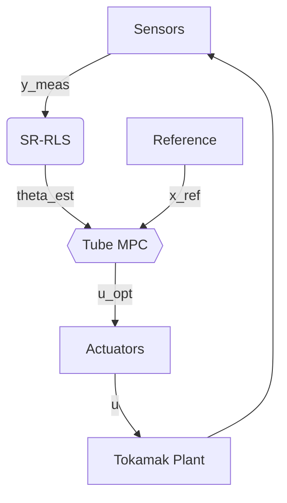

# AION CORE: Adaptive Robust Control Framework

**AION (Adaptive Intelligence for Operation & Navigation)** is a real-time control framework designed for unstable magnetic confinement systems (Tokamaks). It integrates **Square-Root Recursive Least Squares (SR-RLS)** identification with **Tube-based Model Predictive Control (Tube-MPC)**.

---

## 🏗️ Architecture

The system operates in a closed-loop cycle with a strict 1ms time budget.

---

## 📐 Mathematical Formulation

### 1. System Identification (SR-RLS)
To maintain numerical stability, AION uses Square-Root factorization ($P = S S^T$).
Parameter update law:

$$\theta_k = \theta_{k-1} + K_k (y_k - \phi_k^T \theta_{k-1})$$

### 2. Robust Tube MPC
Optimization cost function:

$$J = \sum_{k=0}^{N-1} ( ||\bar{x}_k - x_{ref}||_Q^2 + ||\bar{u}_k||_R^2 )$$

---

## 📊 Validation Results

Performance under Type-I ELM disturbance:

## 📚 References
1. **Åström, K. J.** (2013). *Adaptive Control*.
2. **Mayne, D. Q.** (2005). *Robust MPC of constrained linear systems*.

---
*Last Verification: 2025-12-26 17:25:32*